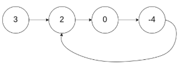

# Leetcode 141 环形链表

> [环形链表](https://leetcode-cn.com/problems/linked-list-cycle/)

## 题目

给定一个链表，判断链表中是否有环。

为了表示给定链表中的环，我们使用整数 pos 来表示链表尾连接到链表中的位置（索引从 0 开始）。 如果 pos 是 -1，则在该链表中没有环。

- **示例1：**

  ```
  输入：head = [3,2,0,-4], pos = 1
  输出：true
  解释：链表中有一个环，其尾部连接到第二个节点。
  ```

  

- **示例2：**

  ```
  输入：head = [1,2], pos = 0
  输出：true
  解释：链表中有一个环，其尾部连接到第一个节点。
  ```

  

- **示例3：**

  ```
  输入：head = [1], pos = -1
  输出：false
  解释：链表中没有环。
  ```

  

## 解答

- 思路：

  - 可以用快慢指针（快指针一次走两步，慢指针一次走一步）；
  - 如果快指针率先到达链表尾，则表示链表没有环路；
  - 如果快指针走若干步后和慢指针相遇，则表示链表肯定有环路。
  - PS: https://labuladong.gitbook.io/algo/suan-fa-si-wei-xi-lie/shuang-zhi-zhen-ji-qiao (这里有对双指针用法的详细总结，包括快慢指针，有图解)

- 代码：

  ```python
  def hasCycle(self, head):
      """
      
      (knowledge)
  
      思路：
      1. 可以用快慢指针（快指针一次走两步，慢指针一次走一步）；
      2. 如果快指针率先到达链表尾，则表示链表没有环路；
      3. 如果快指针走若干步后和慢指针相遇，则表示链表肯定有环路。
  
      PS: https://labuladong.gitbook.io/algo/suan-fa-si-wei-xi-lie/shuang-zhi-zhen-ji-qiao
          (这里有对双指针用法的详细总结，包括快慢指针，有图解)
      """
      low, fast = head, head
      while fast and fast.next:
          low, fast = low.next, fast.next.next
          if low == fast:
              return True
      return False
  ```

## 测试验证

```python
class ListNode:
    def __init__(self, x):
        self.val = x
        self.next = None
    
    def __repr__(self):
        if self:
            return "{}->{}".format(self.val, repr(self.next))


class Solution:
    def hasCycle(self, head):
        """
        
        (knowledge)

        思路：
        1. 可以用快慢指针（快指针一次走两步，慢指针一次走一步）；
        2. 如果快指针率先到达链表尾，则表示链表没有环路；
        3. 如果快指针走若干步后和慢指针相遇，则表示链表肯定有环路。

        PS: https://labuladong.gitbook.io/algo/suan-fa-si-wei-xi-lie/shuang-zhi-zhen-ji-qiao
            (这里有对双指针用法的详细总结，包括快慢指针，有图解)
        """
        low, fast = head, head
        while fast and fast.next:
            low, fast = low.next, fast.next.next
            if low == fast:
                return True
        return False


if __name__ == '__main__':
    solution = Solution()
    head = ListNode(3)
    head.next = ListNode(2)
    head.next.next = ListNode(0)
    head.next.next.next = ListNode(4)
    head.next.next.next = head.next
    print(solution.hasCycle(head), "= True")
```