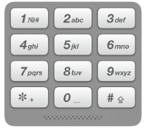

# Leetcode 17 电话号码的字母组合

> [电话号码的字母组合](https://leetcode-cn.com/problems/letter-combinations-of-a-phone-number/)

## 题目

给定一个仅包含数字 `2-9` 的字符串，返回所有它能表示的字母组合。

给出数字到字母的映射如下（与电话按键相同）。注意 1 不对应任何字母。



- **示例：**

  ```
  输入："23"
  输出：["ad", "ae", "af", "bd", "be", "bf", "cd", "ce", "cf"].
  ```

**说明:**
尽管上面的答案是按字典序排列的，但是你可以任意选择答案输出的顺序。

## 解答

- 思路：

  - 这是一个回溯问题，且没有最优子结构，不能用动态规划，所以可以使用回溯框架用递归方式解决；
  - 回溯框架套路看这里 => https://labuladong.gitbook.io/algo/di-ling-zhang-bi-du-xi-lie/hui-su-suan-fa-xiang-jie-xiu-ding-ban

- 代码：

  ```python
  numMap = {'2': "abc", '3': "def", '4': "ghi", '5': "jkl", '6': "mno", '7': "pqrs", '8': "tuv", '9': "wxyz"}
  def letterCombinations(self, digits):
      """
      :type digits: str
      :rtype: List[str]
  
      (Knowledge)
  
      思路：
      1. 这是一个回溯问题，且没有最优子结构，不能用动态规划，所以可以使用回溯框架用递归方式解决；
          回溯框架套路看这里 => https://labuladong.gitbook.io/algo/di-ling-zhang-bi-du-xi-lie/hui-su-suan-fa-xiang-jie-xiu-ding-ban
      """
      def _letterCombinations(path, digits, index, result):
          """
          :type path: str => 当前路径
          :type digits: str => 原数字字符串
          :type index: int => 当前遍历位置
          :type result: List[str] => 存储结果
          """
          if index == len(digits) - 1:
              for ch in self.numMap[digits[index]]:
                  result.append(path + ch)
              return
  
          for ch in self.numMap[digits[index]]:
              _letterCombinations(path + ch, digits, index + 1, result)
  
      # 对空字符串进行特判
      if not digits:
          return []
      result = []
      _letterCombinations("", digits, 0, result)
      return result
  ```

## 测试验证

```python
class Solution:
    numMap = {'2': "abc", '3': "def", '4': "ghi", '5': "jkl", '6': "mno", '7': "pqrs", '8': "tuv", '9': "wxyz"}
    def letterCombinations(self, digits):
        """
        :type digits: str
        :rtype: List[str]

        (Knowledge)

        思路：
        1. 这是一个回溯问题，且没有最优子结构，不能用动态规划，所以可以使用回溯框架用递归方式解决；
            回溯框架套路看这里 => https://labuladong.gitbook.io/algo/di-ling-zhang-bi-du-xi-lie/hui-su-suan-fa-xiang-jie-xiu-ding-ban
        """
        def _letterCombinations(path, digits, index, result):
            """
            :type path: str => 当前路径
            :type digits: str => 原数字字符串
            :type index: int => 当前遍历位置
            :type result: List[str] => 存储结果
            """
            if index == len(digits) - 1:
                for ch in self.numMap[digits[index]]:
                    result.append(path + ch)
                return

            for ch in self.numMap[digits[index]]:
                _letterCombinations(path + ch, digits, index + 1, result)

        # 对空字符串进行特判
        if not digits:
            return []
        result = []
        _letterCombinations("", digits, 0, result)
        return result


if __name__ == '__main__':
    solution = Solution()
    print(solution.letterCombinations("23"), '= ["ad", "ae", "af", "bd", "be", "bf", "cd", "ce", "cf"]')
```