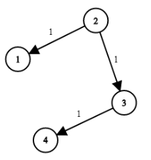

# Leetcode 743 网络延迟时间

> [网络延迟时间](https://leetcode-cn.com/problems/network-delay-time/)

## 题目

有 `N` 个网络节点，标记为 `1` 到 `N`。

给定一个列表 `times`，表示信号经过**有向**边的传递时间。 `times[i] = (u, v, w)`，其中 `u` 是源节点，`v` 是目标节点，`w` 是一个信号从源节点传递到目标节点的时间。

现在，我们从某个节点 `K` 发出一个信号。需要多久才能使所有节点都收到信号？如果不能使所有节点收到信号，返回 `-1`。

**示例：**



```
输入：times = [[2,1,1],[2,3,1],[3,4,1]], N = 4, K = 2
输出：2
```

**注意:**

1. `N` 的范围在 `[1, 100]` 之间。
2. `K` 的范围在 `[1, N]` 之间。
3. `times` 的长度在 `[1, 6000]` 之间。
4. 所有的边 `times[i] = (u, v, w)` 都有 `1 <= u, v <= N` 且 `0 <= w <= 100`。

## 解答

- 思路：

  - 用Dijkstra算法求节点K到其它所有节点的最短距离；
  - 最后返回所有最短距离里面最大的即可；

- 代码：

  ```python
  def networkDelayTime(self, times: List[List[int]], N: int, K: int) -> int:
      """
      :type times: List[List[int]]
      :type N: int
      :type K: int
      :rtype int
  
      (knowledge)
  
      思路：
      1. 用Dijkstra算法求节点K到其它所有节点的最短距离；
      2. 最后返回所有最短距离里面最大的即可；
      """
  
      # 构造图
      graph = collections.defaultdict(dict)
      for u, v, w in times:
          graph[u][v] = w
  
      visited = {}
  
      # 一个最小堆，用来存储Dijkstra算法执行过程中的候选节点
      pq = [(0, K)]
  
      while pq:
          distance, node = heapq.heappop(pq)
  
          # 跳过已遍历的节点
          if node in visited:
              continue
  
          visited[node] = distance
  
          for neighbour, time in graph[node].items():
              if neighbour not in visited:
                  # 遍历每个邻居的时候都会执行push操作，可能有一个点被push若干次，但是由于堆的特性，最先被访问到的一定是距离最小的那个
                  heapq.heappush(pq, (distance + time, neighbour))
  
      # 如果节点K可到达所有节点，则返回最远的距离，否则返回-1
      return max(visited.values()) if len(visited) == N else -1
  ```

## 测试验证

```python
import collections
import heapq
from typing import List


class Solution:
    def networkDelayTime(self, times: List[List[int]], N: int, K: int) -> int:
        """
        :type times: List[List[int]]
        :type N: int
        :type K: int
        :rtype int

        (knowledge)

        思路：
        1. 用Dijkstra算法求节点K到其它所有节点的最短距离；
        2. 最后返回所有最短距离里面最大的即可；
        """

        # 构造图
        graph = collections.defaultdict(dict)
        for u, v, w in times:
            graph[u][v] = w

        visited = {}

        # 一个最小堆，用来存储Dijkstra算法执行过程中的候选节点
        pq = [(0, K)]

        while pq:
            distance, node = heapq.heappop(pq)

            # 跳过已遍历的节点
            if node in visited:
                continue

            visited[node] = distance

            for neighbour, time in graph[node].items():
                if neighbour not in visited:
                    # 遍历每个邻居的时候都会执行push操作，可能有一个点被push若干次，但是由于堆的特性，最先被访问到的一定是距离最小的那个
                    heapq.heappush(pq, (distance + time, neighbour))

        # 如果节点K可到达所有节点，则返回最远的距离，否则返回-1
        return max(visited.values()) if len(visited) == N else -1


if __name__ == '__main__':
    solution = Solution()
    print(solution.networkDelayTime([[2, 1, 1], [2, 3, 1], [3, 4, 1]], 4, 2), "= 2")
```