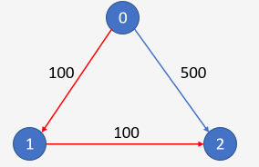
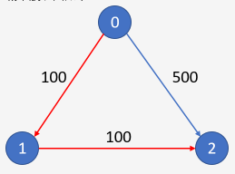

# Leetcode 787 K 站中转内最便宜的航班

> [K 站中转内最便宜的航班](https://leetcode-cn.com/problems/cheapest-flights-within-k-stops/)

## 题目

有 `n` 个城市通过 `m` 个航班连接。每个航班都从城市 `u` 开始，以价格 `w` 抵达 `v`。

现在给定所有的城市和航班，以及出发城市 `src` 和目的地 `dst`，你的任务是找到从 `src` 到 `dst` 最多经过 `k` 站中转的最便宜的价格。 如果没有这样的路线，则输出 `-1`。

**示例 1：**

```
输入: 
n = 3, edges = [[0,1,100],[1,2,100],[0,2,500]]
src = 0, dst = 2, k = 1
输出: 200
```

解释: 
城市航班图如下



从城市 0 到城市 2 在 1 站中转以内的最便宜价格是 200，如图中红色所示。

**示例 2：**

```
输入: 
n = 3, edges = [[0,1,100],[1,2,100],[0,2,500]]
src = 0, dst = 2, k = 0
输出: 500
```

解释: 
城市航班图如下



从城市 0 到城市 2 在 0 站中转以内的最便宜价格是 500，如图中蓝色所示。

**提示：**

- `n` 范围是 `[1, 100]`，城市标签从 `0` 到 `n`` - 1`.
- 航班数量范围是 `[0, n * (n - 1) / 2]`.
- 每个航班的格式 `(src, ``dst``, price)`.
- 每个航班的价格范围是 `[1, 10000]`.
- `k` 范围是 `[0, n - 1]`.
- 航班没有重复，且不存在环路

## 解答

- 思路：

  - 执行Djikstra算法计算最短距离的算法，过程中传递当前的跳数，当跳数超过k+1时进行剪枝；
  - 使用最小堆来简化Djikstra代码实现； 
  - 过程中一旦遍历到目的节点，就返回;

- 代码：

  ```python
  def findCheapestPrice(self, n: int, flights: List[List[int]], src: int, dst: int, K: int) -> int:
      """
      :type n: int 城市个数
      :type flights: List[List[int]]  m个航班
      :type src: int 出发城市
      :type dst: int 到达城市
      :type K: int 最大中转次数
      :rtype int
  
      (knowledge)
  
      思路：
      1. 执行Djikstra算法计算最短距离的算法，过程中传递当前的跳数，当跳数超过k+1时进行剪枝；
      2. 使用最小堆来简化Djikstra代码实现； 
      3. 过程中一旦遍历到目的节点，就返回;
      """
  
      # 这边使用字典来统一表示图
      graph = collections.defaultdict(dict)
  
      # 构建图
      for u, v, w in flights:
          graph[u][v] = w
  
      # 最小堆中的每个元素为一个三元组，<源节点到当前节点的开销，源节点到当前节点走了几跳，当前节点编号>
      pq = [(0, 0, src)]
  
      while pq:
  
          # 从最小堆中取出cost最小的元素
          cost, step, place = heapq.heappop(pq)
  
          # 如果到达当前节点的跳数大于K+1，则跳过
          if step > K + 1:
              continue
  
          if place == dst:
              return cost
  
          # 遍历当前节点的所有邻居
          for neighbour, weight in graph[place].items():
              heapq.heappush(pq, (cost + weight, step + 1, neighbour))
      return -1
  ```

## 测试验证

```python
import collections
import heapq
from typing import List


class Solution:
    def findCheapestPrice(self, n: int, flights: List[List[int]], src: int, dst: int, K: int) -> int:
        """
        :type n: int 城市个数
        :type flights: List[List[int]]  m个航班
        :type src: int 出发城市
        :type dst: int 到达城市
        :type K: int 最大中转次数
        :rtype int

        (knowledge)

        思路：
        1. 执行Djikstra算法计算最短距离的算法，过程中传递当前的跳数，当跳数超过k+1时进行剪枝；
        2. 使用最小堆来简化Djikstra代码实现； 
        3. 过程中一旦遍历到目的节点，就返回;
        """

        # 这边使用字典来统一表示图
        graph = collections.defaultdict(dict)

        # 构建图
        for u, v, w in flights:
            graph[u][v] = w

        # 最小堆中的每个元素为一个三元组，<源节点到当前节点的开销，源节点到当前节点走了几跳，当前节点编号>
        pq = [(0, 0, src)]

        while pq:

            # 从最小堆中取出cost最小的元素
            cost, step, place = heapq.heappop(pq)

            # 如果到达当前节点的跳数大于K+1，则跳过
            if step > K + 1:
                continue

            if place == dst:
                return cost

            # 遍历当前节点的所有邻居
            for neighbour, weight in graph[place].items():
                heapq.heappush(pq, (cost + weight, step + 1, neighbour))
        return -1


if __name__ == '__main__':
    solution = Solution()
    print(solution.findCheapestPrice(3, [[0, 1, 100], [1, 2, 100], [0, 2, 500]], 0, 2, 1), "= 200")
    print(solution.findCheapestPrice(3, [[0, 1, 100], [1, 2, 100], [0, 2, 500]], 0, 2, 0), "= 500")
```